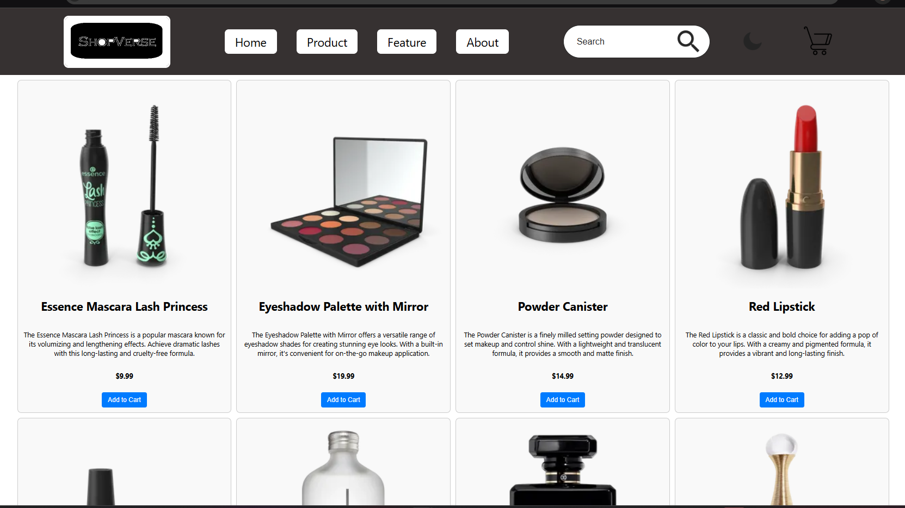

## Project Info

This is a React-based app created as part of the Placewit Project.

This is a React-based app created as part of the Placewit Project Group-4.

SHOPVERSE – Your Gateway to Smart Shopping

🚀 Overview
ShopVerse is a React-based e-commerce front-end application developed by Group 4. It fetches and showcases product data from the DummyJSON API, designed to emulate a real-world online store. The application focuses on responsiveness, intuitive navigation, and a visually appealing layout that enhances the user's shopping experience.

📦 API Used:
https://dummyjson.com/products?limit=194&skip=0

🔧 Features
1. 🔲 Dynamic Card Display
Each product is represented by a custom card showing:

Product image

Title and category

Price and rating

Truncated description with "Show More" feature

The design adapts the layout dynamically using Flexbox and media queries.

2. 🔢 Pagination
Displays 10 products per page.

Built-in pagination allows smooth navigation across 194 products.

Dynamically calculates and renders page numbers.

3. 📖 Show More / Show Less
Product descriptions are initially truncated.

Users can toggle "Show More" to expand or collapse full descriptions, enhancing readability and reducing clutter.

4. 📱 Responsive UI
Built using CSS Flexbox and media queries.

Layouts automatically adjust for desktops, tablets, and mobile devices.

Special attention to spacing, font size, and image resizing.

5. 📄 Detailed Product Pages
Clicking on a product card routes the user to a detailed view.

Shows expanded information including brand, stock availability, full description, and rating.

Implemented using React Router DOM.

6. 🔍 Custom Navbar
Themed navigation bar with:

Navigation links (Home, Products, etc.)

Search bar

Toggle icons

Search input is styled to blend into the e-commerce theme.

7. 🧾 Footer with Social Media Links
Custom footer includes:

Contact information

Social media icons (LinkedIn, Instagram, Twitter)

Copyright

Enhances branding and encourages user engagement.

🛠️ Tech Stack
Technology	Role
React.js	UI rendering and component logic
Axios	Fetching API data
React Router DOM	Routing and navigation
CSS	Styling with Flexbox and responsiveness
DummyJSON API	Backend product data source

🧪 Future Enhancements
🔍 Search Functionality: Dynamic search that filters cards as you type.

🎛️ Product Filtering: By category, price range, rating.

🛒 Shopping Cart: Add-to-cart feature with local storage integration.

📊 Sorting: Sort by price, ratings, or popularity.

🧾 User Authentication: Sign in/sign up for custom user experience.

📄 License
This project is intended for educational and demonstration purposes only. Not for commercial use.

## 🖼️ Screenshots

### 🏠 Homepage

